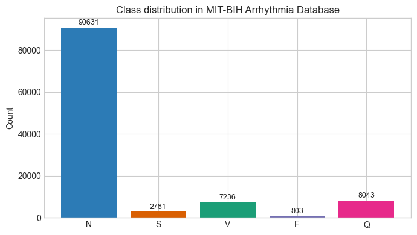
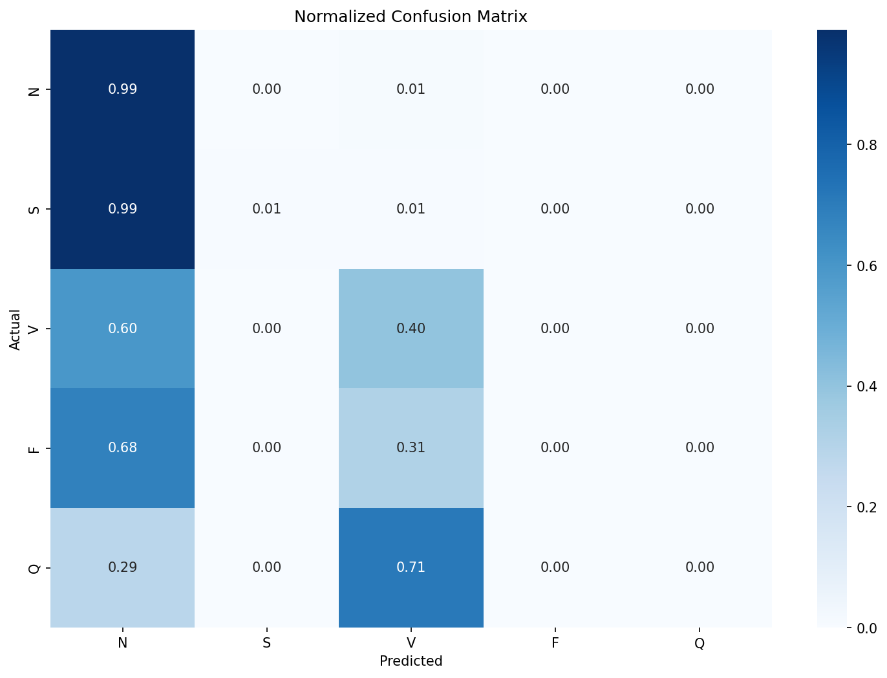
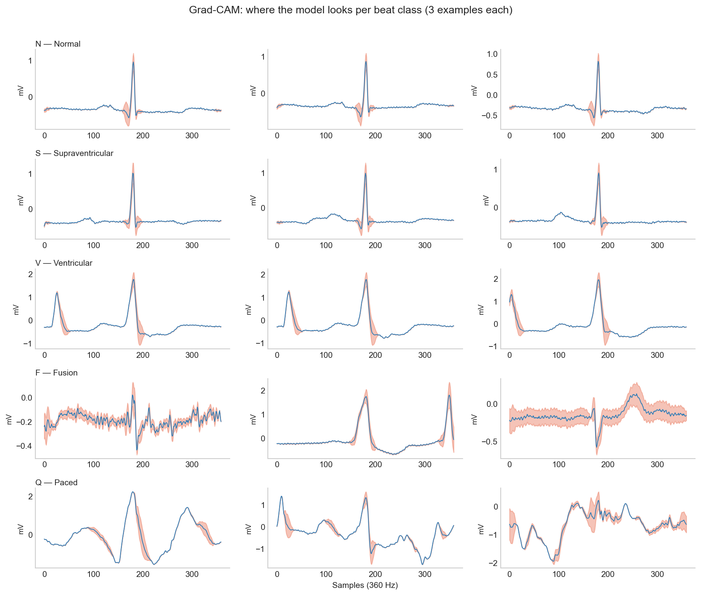

Numbers don't lie, but they do mislead. Especially when we look at them without the full context. For example, say there's a deep learning model that's 91% accurate. While that number *sounds* impressive, the model is essentially useless. I recently built a baseline Convolutional Neural Network (CNN) model to classify Electrocardiogram (ECG) signals into five classes: Normal (N), Supraventricular (S), Ventricular (V), Fusion (F), and Paced (Q) (More detail about the classes and the dataset are provided below). This, in theory, is a textbook example of where deep learning (DL) models should shine ^[Similar to image classification tasks where they're [quite good](https://poloclub.github.io/cnn-explainer/)]. However, there's one huge problem with the dataset: classes are severely imbalanced. One class makes up 83% of all the examples (the Normal class) and if the model simply predicts that everything in the dataset belongs to that class, then it would get an accuracy score of 83% yet fail to detect a single arrhythmia beat. This problem is called *class imbalance* and it can be notoriously hard to deal with for ML/DL projects.

# The Dataset

I used the MIT-BIH Arrhythmia Dataset (!insert bibliography link here), which is one of the most widely used benchmarks in cardiac signal processing research. The dataset contains 48 half-hour recordings taken from 47 different patients using Holter monitors. Each recording contains two channels of ECG (Lead II and one of the V-leads), sampled at 360 Hz and over 109,000 individual heartbeats were manually reviewed and annotated by two independent cardiologists. I grouped the various annotations into 5 super classes, following AAMI guidelines (!link guideline site/paper):

| Class | Clinical Description | Annotations Included |
| :--- | :--- | :--- |
| **N** (Normal) | Standard heartbeat following the regular electrical pathway. Includes slight conduction delays (like bundle branch blocks) that are not premature. | `N`, `L`, `R`, `e`, `j` |
| **S** (Supraventricular) | Premature beat originating in the atria. Travels down the normal pathway, making it look morphologically similar to an 'N' beat, but temporally early. | `A`, `a`, `J`, `S` |
| **V** (Ventricular) | Premature beat originating in the ventricles. Travels backward through tissue, resulting in a wide, bizarre morphology distinct from 'N' beats. | `V`, `E` |
| **F** (Fusion) | A temporal collision between a normal beat and a ventricular beat, resulting in a hybrid morphology that blends 'N' and 'V' characteristics. | `F` |
| **Q** (Paced/Unknown) | Unclassifiable or artificially generated beats, including pacemaker spikes or segments corrupted by severe noise and movement artifacts. | `/`, `f`, `U` |

The morphological differences between classes are visible in the raw ECG signal but as we'll see later, morphology alone isn't always enough.

{.lightbox}

::: {.callout-note}
## A Note on Train/Test Split

I used the standard DS1/DS2 patient-wise split defined by AAMI EC57 standard, which divides the data into 22 records for training and 22 for testing with no patient appearing in both. This ensures that there's no data leakage from the Training set onto the Testing set. ECG morphology is highly individual and random beat-level splitting with same patients in both training and test set inflates every metric. In fact, most papers that report over 98% accuracy on this dataset use intra-patient splits. 
:::

# Baseline CNN Model

To establish a baseline, I built an intentionally simple 1D CNN model with 3 convolutional layers, global average pooling and a five-class dense output layer. It takes in a 360 sample window centered around the R-peak of the beat. Here's the [normalized confusion matrix](https://scikit-learn.org/stable/auto_examples/model_selection/plot_confusion_matrix.html) on the model's predictions from the unseen DS2 test set:

It's clear that the model is just predicting most of the beats as N class and a few as V class. The recall for the rest of the classes is non-existent. The accuracy of this model would be 91% yet failed to detect a single arrhythmia class reliably and would be an unmitigated disaster if deployed in the real-world. A better metric in this case would be the [f1-score](https://towardsdatascience.com/micro-macro-weighted-averages-of-f1-score-clearly-explained-b603420b292f/). The Macro-F1 for this model was 0.29.

| Class / Metric | Precision | Recall | F1-Score | Support |
|:---|---:|---:|---:|---:|
| **N** | 0.92 | 0.99 | 0.95 | 44235 |
| **S** | 0.22 | 0.01 | 0.01 | 1837 |
| **V** | 0.70 | 0.40 | 0.51 | 3220 |
| **F** | 0.00 | 0.00 | 0.00 | 388 |
| **Q** | 0.00 | 0.00 | 0.00 | 7 |
| **accuracy** | | | 0.91 | 49687 |
| **macro avg** | 0.37 | 0.28 | 0.29 | 49687 |
| **weighted avg** | 0.87 | 0.91 | 0.88 | 49687 |

: Classification Report - Baseline CNN Model {#tbl-classification-report}

# Standard Fixes

The standard approaches in ML workflows when encountering this kind of class imbalance is to tweak the [loss function](https://www.datacamp.com/tutorial/loss-function-in-machine-learning) or to generate 'synthetic' data for classes with less examples for the model to train on.

## Weighted Cross-Entropy Loss

Instead of having all classes have the same weight ^[As in Standard Cross-Entropy Loss, which was the loss function used in the baseline CNN model (and most simple classification models)], weighted cross-entropy loss assigns weight based on class distribution. This penalizes the network more for missing rare classes. The Ventricular (V) F1 score improved slightly (0.51 to 0.59), but the S class barely moved (0.01 to 0.07). The Macro F1 nudged along from 0.29 to 0.30.

## Focal Loss

Focal Loss [@lin2017focal] makes the network focus on 'hard to classify' beats by using a dynamically scaling loss that down-weights easy examples. This is the preferred loss function in standard ML workflows for datasets with severe class imbalance. However, in this case, it failed to outperform weighted cross-entropy loss ^[A gamma value of 2.0 was used, which is the default. Read the [original paper](https://arxiv.org/abs/1708.02002) for more details].

## Synthetic Data (SMOTE)

SMOTE (Synthetic Minority Over-sampling Technique) is an ML algorithm that creates synthetic samples for under-represented classes by essentially interpolating the existing examples from that class ^[The math behind SMOTE and some its variants are presented [here](https://www.emergentmind.com/topics/smote-algorithm)]. For this dataset and model, it provided best S class result so far (0.15) but failed to move the needle on other classes.

To understand why SMOTE failed in this case, we only need to look at examples of the synthetic data. The Q class also is at a severe disadvantage because there are only 8 real examples in the DS1 training split and interpolating between them to create 45,833 beats means creating a whole lot of randomness. 

{.lightbox}

Ultimately, these are general purpose tools that lack domain knowledge. Applying them to a dataset with severe class imbalance is far less likely to succeed unless we provide it relevant information.

# Domain Knowledge

Deep Learning models like the CNN are really good at extracting morpholgical features from a given signal - like edges, curves and slopes. This is why the baseline model does a decent job in classifying V class, as their QRS complexes are distinctly wider than N beats. However, the model doesn't know that what makes the S beats different from N beats is their timing. Cardiologists don't just look at the shapes of individual beats but they also look at their timings (RR intervals) and S beats, although morphologically similar to N beats, are *premature* beats. A model that only looks at a beat's morphology has no access to the timing of the beats before or after.

To fix this, I calculated 3 specific timing-related features for all the beats:

| Feature | Description |
|:---|:---|
| **Pre-RR Interval** | The time elapsed since the previous R-wave. |
| **Post-RR Interval** | The time until the next R-wave. |
| **Local RR Ratio** | The current RR interval divided by a moving average of the patient's recent heart rate. |

: RR Interval Features {#tbl-rr-features}

When calculating these features per class, the difference was obvious. Average pre-RR interval for N class was 0.778 seconds whereas for S class, it was 0.506 seconds. I updated the CNN architecture so these 3 features are added to the flattened morphological embeddings from the CNN, right before the final dense classification layer.

The results were meaningful - especially for S and V classes. S class F1 score went up to 0.48 from 0.01 and V class F1-score also increased to 0.7. Just adding these three numbers increased the overall macro-F1 score from 0.3 to 0.44 while the standard methods couldn't improve it at all. 

| Experiment | Accuracy | Macro F1 | S F1 | V F1 | F F1 |
|:---|---:|---:|---:|---:|---:|
| **Baseline CNN** | 0.91 | 0.29 | 0.01 | 0.51 | 0.00 |
| **Weighted CE loss** | 0.69 | 0.30 | 0.07 | 0.59 | 0.02 |
| **Focal loss ($\gamma=2$)** | 0.90 | 0.30 | 0.00 | 0.53 | 0.00 |
| **SMOTE oversampling** | 0.65 | 0.29 | 0.15 | 0.52 | 0.01 |
| **CNN + RR features** | 0.85 | 0.44 | 0.48 | 0.70 | 0.10 |

: Results Comparison {#tbl-results-comp}

# Grad-CAM

Numbers only tell part of the story. Like I wrote in the [Activity Recognition post](https://maniravi.com/projects/imu-processing-cnn-svm/), it's important to figure out what features a deep learning model is actually learning or missing. To do this, I implemented a widely used technique called Grad-CAM (Gradient-weighted Class Activation Mapping) [@selvaraju2020grad]. Put simply, Grad-CAM visually highlights the regions in the signal (or image) that had the most influence in the network's classification decision. I hooked it up to the final convolutional layer and ran some examples through it to produce the heatplots below.

{.lightbox}

| Beat Type | Attention Analysis |
|:---|:---|
| **N & V Beats** | Consistent focus on meaningful signal parts (e.g., wide QRS). The model learned something real. |
| **S Beats** | Consistently focuses on QRS to verify shape. Injected RR features do the heavy lifting for classification. |
| **F Beats** | Completely inconsistent attention. No learned strategy, explaining the dismal F1 score. |
| **Q Beats** | Diffuse, wildly different heatmaps. The model is just guessing. |

: Attention Map Analysis {#tbl-attention-analysis}

Reading across the rows of the figure gives us valuable information about the model's performance and tell us whether the model learned something clinically grounded. For F and Q classes, the problem is in the dataset. It is extremely build any model to accurately detect only 414 training examples of a morphologically ambiguous class.

# Conclusion

I intentionally tried to keep things simple in this project - a simple CNN model, standard mitigation strategies and just a handful of timing features added - because my main aim was to explain the need for clinical grounding. There are some papers that have achieved a high F1-score on this dataset ^[Once again, be sure to check the train-test split when reading *any* paper that use this dataset. A lot of them don't use the strict DS1/DS2 patient-level that I used here] by using advanced methods such as a CNN+BiLSTM architecture (!insert most cited paper here) that takes in longer windows (3 to 5 beats) as input so it can calculate some of the timing features that I hand-engineered. Another technique is to use a Transformer architecture with multi-headed attention mechanism (!insert most cited/relevant paper here) where instead of treating every part opf the signal equally, the model learns to dynamically focus its attention on specific temporal areas of the signal.

I chose a very strict train-test split on purpose to make sure that there wasn't any patient data leakage from training data to the test data. This ensures that the results are accurately representative of what the model might do if it encounters a completely new patient. For practical purposes, however, it is possible that the real-time system can use a short amount of patient specific data (say, the first 2-5 minutes) to perform patient-specific calibration that can meaningfully improve accuracy and recall.

My main takeaway from this project was that clinical grounding is essential when making decisions at every step in clincial AI development. From dataset split, feature engineering, evaluation metric to explainability: ask if this is what a clinician would be looking at and if this reflects what years of clinical knowledge has taught us.