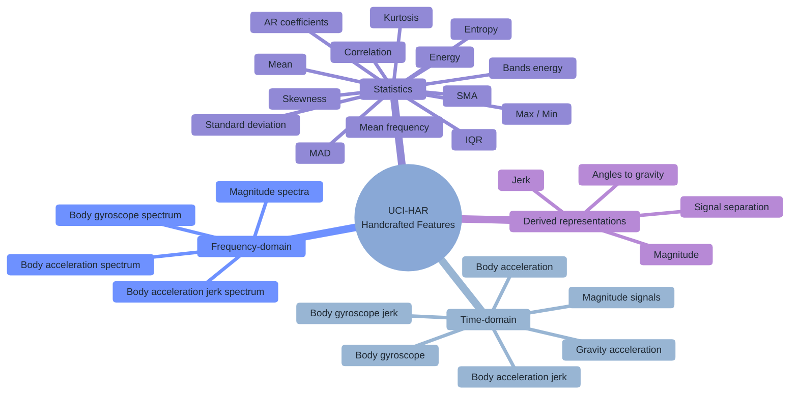

# Drafts that may or may not be used in the main file:

## Mermaid figure for showing features

For example, here are the features in the dataset:
```{mermaid}

```mermaid
%%{init: {
  "theme": "base",
  "themeVariables": {
    "primaryColor": "#E8EEF7",
    "primaryBorderColor": "#4A6FA5",
    "primaryTextColor": "#1F2933",
    "secondaryColor": "#F1F5F9",
    "tertiaryColor": "#EEF2FF",
    "lineColor": "#64748B",
    "fontSize": "14px"
  }
}}%%

mindmap
  root((UCI-HAR<br>Handcrafted Features))
    Time-domain
      Body acceleration
      Gravity acceleration
      Body acceleration jerk
      Body gyroscope
      Body gyroscope jerk
      Magnitude signals
    Frequency-domain
      Body acceleration spectrum
      Body acceleration jerk spectrum
      Body gyroscope spectrum
      Magnitude spectra
    Statistics
      Mean
      Standard deviation
      MAD
      Max / Min
      SMA
      Energy
      IQR
      Entropy
      Correlation
      AR coefficients
      Mean frequency
      Bands energy
      Skewness
      Kurtosis
    Derived representations
      Jerk
      Magnitude
      Signal separation
      Angles to gravity
```

