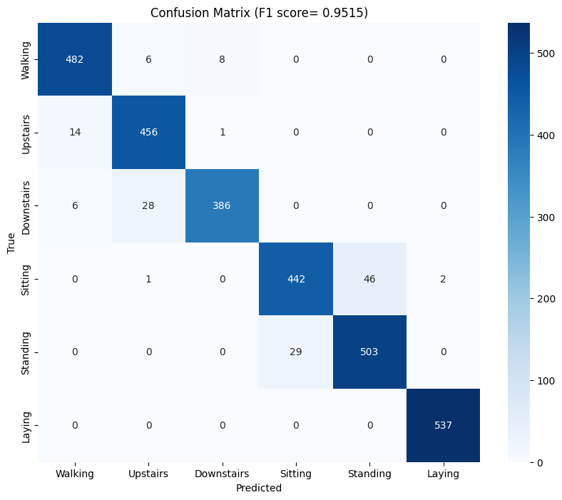
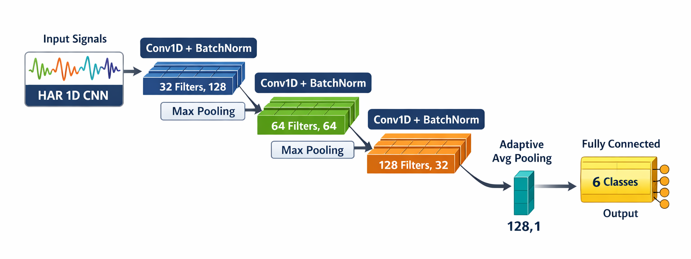
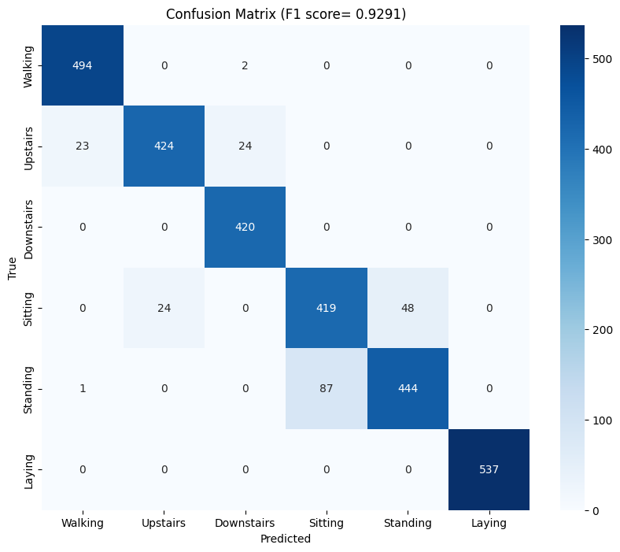

In what seems like many lifetimes ago, it was standard practice to spend the majority of time on a machine learning project engineering features rather than training models. Support Vector Machines (SVMs) for example, were only as good as the features you gave it and therefore, researchers would spend weeks or months actually understanding the physics of the problem before writing a single line of code to build or train the model. 

Activity recognition from inertial measurement unit (IMU) is a good example. We couldn't just hand the raw accelerometer signal to an SVM and hope for the best. Instead, we had to come up with features that would help the model distinguish between activities much like how basketball nerds have to come up with new statistics to classify players across eras into different tiers. The researchers had to think: what does walking actually look like in frequency space? How does the energy distribution change between sitting and standing? What time-domain statistics capture the difference between climbing stairs and walking on flat ground? Then they would compute those features - mean, variance, signal energy, FFT coefficients, jerk signals — window by window, axis by axis. It was slow. It required domain expertise and a lot of trial and error. And it worked reasonably well.

Then came deep learning models. Specifically, Convolutional Neural Networks (CNNs) which could take in the raw IMU signal and *automatically* learn features that help in distinguisghing between activities. Even without any preprocessing or filtering whatsoever. We don't even need to feed it the spectrogram of the signal or the FFT coefficients. One of the most common things to do is to remove the gravity component of the accelerometer signal^[This is usually done by applying a low-pass filter (~0.3 Hz) and then subtracting the low-frequency components], but as we'll see later, even this step isn't necessary for the CNN model. The CNN can learn to ignore the gravity component if it doesn't help with the classification task and conversely, it can also learn gravity if it helps. Visit [this website](https://poloclub.github.io/cnn-explainer/) for a great visual explainer of how CNNs work, albeit for image classification.

# The Dataset

To compare the two approaches, I chose a simple, public dataset provided by the researchers at University of California, Irvine (UCI) [@uci-har-dataset]. The dataset contains smartphone data, specifically 3-axes accelerometer and gyroscope when a total of 30 participants were doing the following activities - Walking, Walking Upstairs, Walking Downstairs, Sitting, Standing, Laying. They also provide 561 hand-engineered features that calculate various statistical, time domain, frequency domain and derivative characteristics. Each time window was 2.56 seconds long and had 50% overlap. 70% of the windows were used for the training set and 30% was reserved for test set. ^[I wouldn't recommend this 70-30 split for any production system or for a scientific paper. Modern practice is to have a train-dev-test set (say 70-15-15) so that the models don't learn from the test samples.]

# Support Vector Machine

Using the features described above, a simple Support Vector Machine (SVM) was trained and the results were impressive ([Macro-F1](https://towardsdatascience.com/micro-macro-weighted-averages-of-f1-score-clearly-explained-b603420b292f/): 0.9515), primarily due to the robustness of the features. Here's the [confusion matrix](https://stanford.edu/~shervine/teaching/cs-229/cheatsheet-machine-learning-tips-and-tricks/#classification-metrics) from the results:

As we can see, it does a really good job on most activities with the exception of sitting and standing where it seems to struggle a bit ^[This is likely due to orientation of smartphone while performing the activities]. In the feature set, the acceleration signal was split into two - body acceleration and gravity acceleration - using a 0.3 Hz Lowpass filter. When ablating (fancy word for removing) features derived from one of these signals, a pattern begins to emerge. The table below shows the impact of ablating some feature groups on the F1 score:

| Signal Feature Group Removed | New F1 Score | F1 Score Drop |
|:---------------------------|:------------:|:------------:|
| *None (Baseline)* | 0.9515       | —            |
| **tGravityAcc** | **0.7083** | **↓ 0.2432** |
| fBodyAcc                    | 0.9022       | ↓ 0.0493     |
| tBodyAcc                    | 0.9174       | ↓ 0.0341     |
| tBodyGyro                   | 0.9187       | ↓ 0.0328     |
| fBodyGyro                   | 0.9384       | ↓ 0.0131     |
| angle_gravity               | 0.9530       | ↑ 0.0015     |
: Results of Feature Group Ablation on SVM Performance {#tbl-ablation}

Turns out, for these 6 tasks at least, gravity acceleration is far more important than body acceleration.

# Convolutional Neural Network

For the same time windows as above, 9 raw signals were also provided in the dataset.

| Signal Index | Signal Name | Physical Source | Description |
|:---:|:---|:---|:---|
| 1-3 | **Total Accel** (X,Y,Z) | Accelerometer | The raw 3-axes accelerometer signals. |
| 4-6 | **Body Accel** (X,Y,Z) | Accelerometer | The high-pass filtered "movement" component. |
| 7-9 | **Body Gyro** (X,Y,Z) | Gyroscope | The angular velocity (rotational speed). |
: The 9 Raw Input Channels for the CNN Model {#tbl-signals}

Using these signals, a simple Convolutional Neural Network (CNN) was trained with either 3 channels, 6 channels or all 9 channels. The architecture of the CNN remained the same - only number of channels was different. Here's the architecture of one of the CNN models:

It is important here to recognize that no further processing of the signals were done ^[Other than the initial filtering that was already done by the researchers]. The signals were input directly into the CNN models along with the labels and everything else is done by the neural net. Here are the results from the different combinations of signals used:

| Input Signals | Channels | Macro-F1 Score |
|:---------------------------|:------------:|:------------:|
| **Single Sensor Source** | | |
| Total Accel Only | 3 | 0.8967 |
| Body Accel Only | 3 | 0.7482 |
| Gyroscope Only | 3 | 0.7355 |
| **Dual Sensor Combinations** | | |
| Total Accel + Gyro | 6 | **0.9291** |
| Total Accel + Body Accel | 6 | 0.9206 |
| Body Accel + Gyro | 6 | 0.8213 |
| **All Signals** | | |
| **Total + Body + Gyro** | **9** | **0.9362** |
: CNN Model Performance vs. Input Signal Combinations {#tbl-cnn-ablation}

It is interesting to see that the same pattern from the SVM is repeating here. Since body acceleration has no gravity information encoded in it, it consistently underperforms when compared with total acceleration. One other thing to note here is that the CNN does surprisingly well *just* with the total acceleration signals even without the gyroscope signals (F1: 0.8967). But the accuracy does improve when gyroscope signals were included. Here's the confusion matrix from the CNN model with total accelerometer and gyroscope signals:

An F-1 score of 0.9291 is slightly below that of the SVM (0.9515) but quite impressive considering the simplicity of the CNN architecture^[This CNN has ~33,000 parameters. Modern CNNs are easily 100 times this size] and the fact that we didn't need *any* domain expertise. In fact, the only domain expertise we did here is to separate out the body acceleration signal and when you add those 3 signals in, we only get a marginal increase in F1 score (0.9362). Since the gravity and body signal are already in the total accelerometer signal, the CNN does a pretty darn good job of teasing them out all on its own.

# Conclusion

So, what's the point here? It may be tempting to conclude that since CNNs are almost as good as old school methods like the SVMs, we should focus more on improving the architecture of CNNs rather than spending months trying to come up with better features. I love CNNs and use them often for signal and image processing or classification tasks. They're incredibly versatile and work really well for most use cases.

But there's a catch here: we can explain the results from the SVMs way better than we can with the CNNs. We can rank which features perform best for which classification task - for example, we can say that the angular acceleration on the y and z axis predominantly distinguish between standing and walking. Whereas with the CNN, we essentially have no idea why or how the model worked. The only thing we can do is similar to what I did here - go through different iterations of inputs (leaving some out) and deduce which signals are important. 

While this may not matter much in this case, it does matter in a lot of other cases. Take automated cancer detection as an example. The CNN may have a 96% accuracy in classifying a suspicious looking mass in an X-ray as cancer but we'll need to know why it missed the 4% so that we can improve the model. Another example is in frontier science - in areas where we humans lack knowledge ourselves. An example of this is Blood Pressure (BP) estimation using Photoplethysmography (PPG) signals using Neural Networks. There's no consensus yet as to specifically what features of the PPG signal influence or help in detetcting BP so even if the model works reasonably well, we need to know *why* it worked. If we increasingly rely on unexplainable AI models, we would be no closer to actually understanding the underlying mechanisms of the problem at hand.

In the last few years, there has been an active push by scientists and engineers in the area of Explainable AI (XAI) which is great news. Tools such as SHAP (SHapley Additive exPlanations) [@lundberg2017unified], LIME (Local Interpretable Model-agnostic Explanations) [@ribeiro2016why], and Grad-CAM (Gradient-weighted Class Activation Mapping) [@selvaraju2017gradcam] help us peek inside the 'black box' of deep learning models and better understand which aspects of the input signals are influencing the model's predictions. However, these tools are still in their infancy and wide adoption of these tools is essential to advance our knowledge of the underlying mechanisms of the problems we're trying to solve.

# References
::: {#refs}
:::